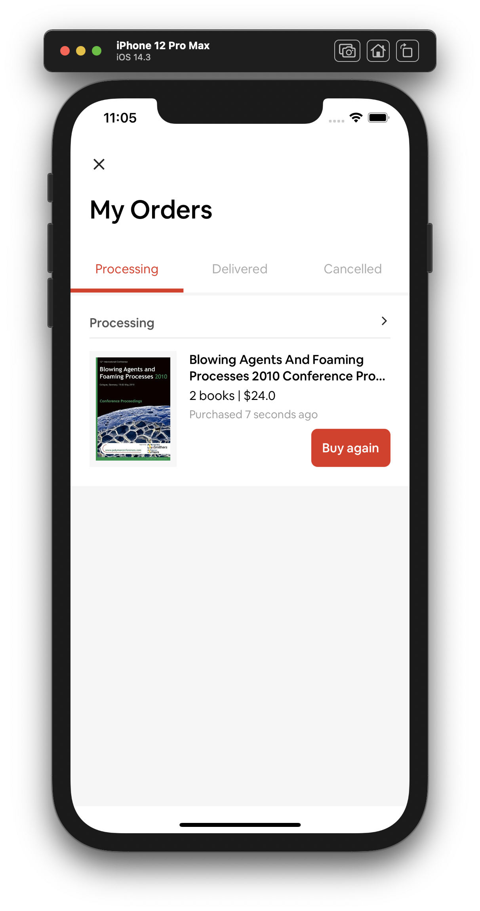

# Bookstore User iOS

Just a simple E-commercial iOS App built with Swift and UIKit

## Building and Using
1. `git clone https://github.com/ldakhoa/bookstore-user-ios`
2. `cd path/to/bsuser`
3. `pod install`
4. `xed .`
5. Run it in Xcode

## Screenshots

